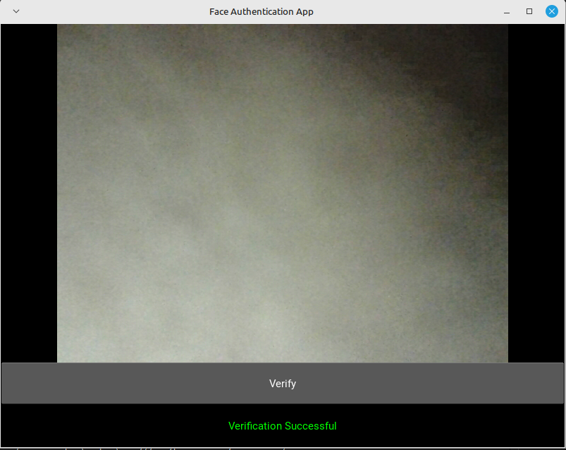

<a id="readme-top"></a>


<!-- PROJECT SHIELDS, for these shield-url, view shields.io for more options -->
<!-- [![MIT License][license-shield]][license-url] -->
<!-- [![LinkedIn][linkedin-shield]][linkedin-url] -->


<!-- PROJECT LOGO -->
<br />
<div align="center">
    
</div>

<br />

<div align="center">

[](https://git.io/typing-svg)

</div>

<div>

  <p align="center">
    <b>A cutting-edge 2D face recognition system based on deep learning</b>
    <br />
    <a href="https://github.com/othneildrew/Best-README-Template"><strong>Explore the docs »</strong></a>
    <br />
    <br />
    <a href="https://github.com/othneildrew/Best-README-Template">View Demo</a>
    ·
    <a href="https://github.com/othneildrew/Best-README-Template/issues/new?labels=bug&template=bug-report---.md">Report Bug</a>
    ·
    <a href="https://github.com/othneildrew/Best-README-Template/issues/new?labels=enhancement&template=feature-request---.md">Request Feature</a>
  </p>
</div>


<!-- TABLE OF CONTENTS -->
<details>
  <summary><b>Table of Contents</b></summary>
  <ol>
    <li>
      <a href="#about-the-project">About The Project</a>
      <ul>
        <li><a href="#built-with">Built With</a></li>
      </ul>
    </li>
    <li>
      <a href="#getting-started">Getting Started</a>
      <ul>
        <li><a href="#prerequisites">Prerequisites</a></li>
        <li><a href="#installation">Installation</a></li>
      </ul>
    </li>
    <li><a href="#usage">Usage</a></li>
    <li><a href="#roadmap">Roadmap</a></li>
    <li><a href="#contributing">Contributing</a></li>
    <li><a href="#license">License</a></li>
    <li><a href="#contact">Contact</a></li>
    <li><a href="#acknowledgments">Acknowledgments</a></li>
  </ol>
</details>


<br />


<!-- ABOUT THE PROJECT -->
# 📝 About The Project 

<div align="center">
    
</div>

<br />


Developed for the Biometric Course IT4432E (Semester 20241) at HUST, this project implements a 2D face recognition system using advanced algorithms for accurate verification. Specifically, we explore our topic by two approaches:

1. Using a pre-trained Model (**FaceNet**) for features extraction, then use those features to train a **Support Vector Machine** model for classification

2. Training a **Siamese netwrok architecture**  + **Distance layer** from scratch

These approaches combine the convenience and accuracy of pre-trained models with the educational value of 
training custom architectures from scratch. After training, we obtain models and use them to build applications with GUI using **Kivy** framework.
<p align="right">(<a href="#readme-top">back to top</a>)</p>


## 🛠️ Built With

The project is built with the following development tools, technologies:


<p align="right">(<a href="#readme-top">back to top</a>)</p>


<!-- USAGE EXAMPLES -->
# 📖 Usage

Use this space to show useful examples of how a project can be used. Additional screenshots, code examples and demos work well in this space. You may also link to more resources.

_For more examples, please refer to the [Documentation](https://example.com)_

<p align="right">(<a href="#readme-top">back to top</a>)</p>


> [!TIP]
> If you only want to see the application demo, download it and follow the installation instructions on the release page and you can stop reading here.

For those interested in our project's details, including structure, code, training process, evaluation, results, etc, you can join us in the following sections.


<!-- GETTING STARTED -->
# 🚀 How to run this project

This is the instruction of how you may give instructions on setting up your project locally.

1. **Clone the repo**
```bash
git clone https://github.com/chutrunganh/Biometric_IT4432E.git
```

2. **Install dependencies**: running these commands inside the project folder

```bash
cd REPLACE_WITH_YOUR_PATH/Biometric_IT4432E

# Activate python virtual environment
python3 -m venv venv
source venv/bin/activate

# Install pip tool if you haven't already
sudo pacman -Syu base-devel python-pip
pip install --upgrade pip setuptools wheel


# Install all required dependencies inside the requirements.txt file
pip install -r requirements.txt
```

It may take about 30 min to download all dependencies inside  of this requirements based on your internet speed.


> [!IMPORTANT]  
> Above command is designed for Arch-based Linux only, for other distros or platforms, make a slight change to meet your system. For example, with Debian-based, replace `sudo pacman -Syu base-devel python-pip` by `sudo apt update && sudo apt upgrade -y && sudo apt install build-essential python3-pip`


3. **Run the application**: 
You can either use Application_CLI.ipynb or Application_GUI.ipynb to run the application.


# 🏗️ Code Structure 

Here are main components of the project with their respective functionalities:

```plain text
BioMetric_IT4432E
|
|--- requirements.txt -> contains all required dependencies
|
|--- readme.md -> contains project information
|
|--- application_data
|     └---validation_images -> contains images for validation
|      
|--- data -> contains images for training models
|
|--- model_saved -> contains trained models
|
|--- preprocessing_data -> contains preprocessed data for Pipeline1
|     |--- faces.npz -> contains compress faces data
|     └--- embeddings.npz -> contains compress embeddings data
|
|--- preprocessing_data(for_Siamese) -> contains preprocessed data for Pipeline2
|     └--- faces.npz -> contains compress faces data
|
|--- 1.DataCollection.ipynb -> Collect data for training
|--- 2.Pipeline1 DataPreprocessing.ipynb -> Preprocess data, face detector, extract feature (using FaceNet)
|--- 2.Pipeline2 DataPreprocessing.ipynb -> Preprocess data for Siamese Network
|--- 3.Pipeline1 SVM_Classifier.ipynb -> Train SVM model
|--- 3.Pipeline2 Siamese_Network.ipynb -> Train Siamese Network
|--- 4.Pipeline1 Application_FaceNet_SVM_CLI.ipynb -> Application using FaceNet + SVM model
|--- 4.Pipeline2 Application_Siamese_Network_CLI.ipynb -> Application using Siamese Network
└--- 4.Pipeline2 Application_Siamese_Network_GUI.py -> Application using Siamese Network with GUI

```

And here is the workflow of the project:

```plain text

                                  / 2.Pipeline1 DataPreprocessing.ipynb -> preprocessing_data folder -> 3.Pipeline1 SVM_Classifier.ipynb -> model_saved folder -> 4.Pipeline1 Application_FaceNet_SVM_CLI.ipynb + application_data/validation_images folder
                                /
1.DataCollection.ipynb -> data /
                                \
                                  \ 2.Pipeline2 DataPreprocessing.ipynb -> preprocessing_data(for_Siamese) folder -> 3.Pipeline2 Siamese_Network.ipynb -> model saved_folder -> 4.Pipeline2 Application_Siamese_Network_CLI.ipynb/4.Pipeline2 Application_Siamese_Network_GUI.py + application_data/validation_images folder
```

<p align="right">(<a href="#readme-top">back to top</a>)</p>

<!-- CONTRIBUTING -->
## 🤝 Contributing

Contributions are what make the open source community such an amazing place to learn, inspire, and create. Any contributions you make are **greatly appreciated**.

If you have a suggestion that would make this better, please fork the repo and create a pull request. You can also simply open an issue with the tag "enhancement".
Don't forget to give the project a star! Thanks again!

1. Fork the Project
2. Create your Feature Branch (`git checkout -b feature/AmazingFeature`)
3. Commit your Changes (`git commit -m 'Add some AmazingFeature'`)
4. Push to the Branch (`git push origin feature/AmazingFeature`)
5. Open a Pull Request


<!-- LICENSE -->
# 📜 License

[](https://www.apache.org/licenses/LICENSE-2.0)


Distributed under the Apache-2.0 License License. See `LICENSE` for more information.

<p align="right">(<a href="#readme-top">back to top</a>)</p>


<!-- CONTACT -->
# 📧 Contact

This project is maintained by: Chu Trung Anh - [Email](mailto:chutrunganh04@gmail.com).

Feel free to contact me if you have any question or suggestion.

<p align="right">(<a href="#readme-top">back to top</a>)</p>
