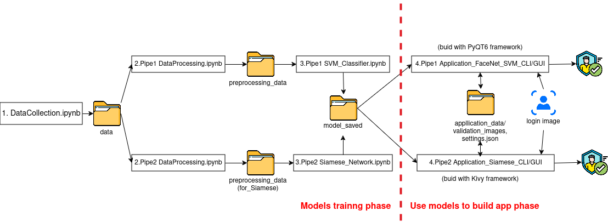

<a id="readme-top"></a>

<!-- PROJECT LOGO -->
<br />
<div align="center">
    
</div>

<br />

<div align="center">

[](https://git.io/typing-svg)

</div>

<div>

  <p align="center">
    <b>A cutting-edge 2D face recognition system based on deep learning</b>
    <br />
    <a href="https://github.com/othneildrew/Best-README-Template"><strong>Explore the docs »</strong></a>
    <br />
    <br />
    <a href="https://github.com/othneildrew/Best-README-Template">Usage</a>
    ·
    <a href="https://github.com/othneildrew/Best-README-Template/issues/new?labels=bug&template=bug-report---.md">Report Bug</a>
    ·
    <a href="https://github.com/othneildrew/Best-README-Template/issues/new?labels=enhancement&template=feature-request---.md">Request Feature</a>
  </p>
</div>


<!-- TABLE OF CONTENTS -->
<details>
  <summary><b>Table of Contents</b></summary>
  <ol>
    <li><a href="#-about-the-project">About The Project</a></li>
    <li><a href="#-usage">Usage and Demo</a></li>
    <li>
      <a href="#-how-to-run-this-project">How to run this project</a>
      <ul>
        <li><a href="#option-1-quick-view-of-model-training">Option 1: Quick View</a></li>
        <li><a href="#option-2-complete-project-setup">Option2: Complete project  setup locally</a></li>
      </ul>
    </li>
    <li><a href="#️-code-structure">Code structure and workflow</a></li>
    <li><a href="#-contributing">Contributing</a></li>
    <li><a href="#contact">Contact</a></li>
  </ol>
</details>


<br />


<!-- ABOUT THE PROJECT -->
# 📝 About The Project 

<div align="center">
    
</div>

<br />


Developed for the Biometric Course IT4432E (Semester 20241) at HUST, this project implements a 2D face recognition system using advanced algorithms for accurate verification. Specifically, we explore our topic by two approaches:

1. Using a pre-trained Model (**FaceNet**) for features extraction, then use those features to train a **Support Vector Machine** model for classification

2. Training a **Siamese netwrok architecture**  + **L1 Distance layer** from scratch

These approaches combine the convenience and accuracy of pre-trained models with the educational value of 
training custom architectures from scratch. After training, we obtain models and use them to build applications with GUI using **PyQT6** and **Kivy** framework.
<p align="right">(<a href="#readme-top">back to top</a>)</p>


## 🛠️ Built With 

The project is built with the following development tools, technologies:


<p align="right">(<a href="#readme-top">back to top</a>)</p>


<!-- USAGE EXAMPLES -->
# 📖 Usage and Demo

Use this space to show useful examples of how a project can be used. Additional screenshots, code examples and demos work well in this space. You may also link to more resources.

_For more examples, please refer to the [Documentation](https://example.com)_

<p align="right">(<a href="#readme-top">back to top</a>)</p>


> [!TIP]
> If you only want to see the application demo, download it and follow the installation instructions on the release page and you can stop reading here.

For those interested in our project's details, including structure, code, training process, evaluation, results, etc, you can join us in the following sections.


<!-- GETTING STARTED -->
# 🚀 How to run this project

## Option 1: Quick View of Model Training
Just want to see the model training process? Check out our Kaggle notebooks:
- [SVM Classifier Pipeline](https://www.kaggle.com/code/trunganhchu/svm-classifier)
- [Siamese Network Pipeline](https://www.kaggle.com/code/trunganhchu/siamese)

## Option 2: Complete Project Setup
Want to explore the full project including data preprocessing, training, and application? Follow our instruction below.

### Installation

1. **Clone the repo**
```bash
git clone https://github.com/chutrunganh/Biometric_IT4432E.git
```

2. **Install dependencies**

Navigate to the project folder:

```bash
cd REPLACE_WITH_YOUR_PATH/Biometric_IT4432E
```

- With Linux

```bash
# Activate python virtual environment
python3 -m venv venv
source venv/bin/activate

# Install pip tool if you haven't already
sudo pacman -Syu base-devel python-pip # With Arch-based
# sudo apt update && sudo apt upgrade -y && sudo apt install build-essential python3-pip  # With Debian-based, use this command instead
pip install --upgrade pip setuptools wheel

# Install all required dependencies 
pip install -r requirements_for_Linux.txt
```

- With Windows

```bash
python -m venv venv
.\venv\Scripts\activate.bat # If execute in CMD
# .\venv\Scripts\activate.ps1 # If execute in PowerShell

# Install pip tool if you haven't already
python -m ensurepip --upgrade
pip install --upgrade pip setuptools wheel

# Install all required dependencies 
pip install -r requirements_for_Windosn.txt

# Install ipykernel in your virtual environment
pip install ipykernel 
python -m ipykernel install --user --name=venv --display-name "Python (venv)" # Create a new kernel for Jupyter

```

Choose the kernel named `venv` when running Jupyter Notebook.

It may take about 15-30 minutes to download all dependencies, depending on your internet speed.


> [!IMPORTANT]  
> This project requires **Python 3.12.x**. Some other versions, such as 3.10.x, have been reported to have compatibility issues with dependencies.

3. **Follow the code files**


Follow the code files from 1 to 4 (you can choose to just follow Pipeline1 or Pipeline2) and read the instructions, run the code inside these files to generate and process data. Note that this is a pipeline, so do not skip any files; otherwise, errors will occur due to missing files.


# 🏗️ Code Structure and Workflow

Here are main components of the project with their respective functionalities:

```plain text
Biometric_IT4432E
|
|── Slide_And_Report 
|
|── requirements_for_Linux/Windows.txt -> contains all required dependencies to run on local
|    
|── data -> contains images for training models
|
|── model_saved -> store models after training
|
|── preprocessing_data -> contains preprocessed data for Pipeline1
|     |── faces.npz -> contains compress faces data
|     └── embeddings.npz -> contains compress embeddings data
|
|── preprocessing_data(for_Siamese) -> contains preprocessed data for Pipeline2
|     └── faces.npz -> contains compress faces data
|
|── application_data
|     |──validation_images -> contains images from enrollment process
|     |   |──user1
|     |   |──user2
|     |   └──...
|     |  
|     └── settings.json -> store deteced camera index
|
|── 1.DataCollection.ipynb -> Collect data for training
|
|── 2.Pipeline1 DataPreprocessing.ipynb -> Preprocess data,face detector (using MTCNN),extract feature (using FaceNet)
|
|── 2.Pipeline2 DataPreprocessing.ipynb -> Preprocess data for Siamese Network
|
|── 3.Pipeline1 SVM_Classifier.ipynb -> Train SVM model
|
|── 3.Pipeline2 Siamese_Network.ipynb -> Train Siamese architecture network
|
|── 4.Pipeline1 Application_FaceNet_SVM_CLI.ipynb
| 
|── 4.Pipeline1 Application_FaceNet_SVM_GUI.py
|
|── 4.Pipeline2 Application_Siamese_Network_CLI.ipynb 
|
└── 4.Pipeline2 Application_Siamese_Network_GUI.py 

```

And here is the workflow of the project:




<p align="right">(<a href="#readme-top">back to top</a>)</p>

<!-- CONTRIBUTING -->
# 🤝 Contributing

Contributions are what make the open source community such an amazing place to learn, inspire, and create. Any contributions you make are **greatly appreciated**.

If you have a suggestion that would make this better, please fork the repo and create a pull request. You can also simply open an issue with the tag "enhancement".
Don't forget to give the project a star! Thanks again!

1. Fork the Project
2. Create your Feature Branch (`git checkout -b feature/AmazingFeature`)
3. Commit your Changes (`git commit -m 'Add some AmazingFeature'`)
4. Push to the Branch (`git push origin feature/AmazingFeature`)
5. Open a Pull Request

For the success of this project, I want a special thanks to:

- **Project supervisor**: Dr. Tran Nguyen Ngoc, Dr. Ngo Thanh Trung
- **Team members**:

  | Name | Student ID |
  |:--|:--|
  | Chu Trung Anh (team leader)| 20225564 |
  | Bui Duy Anh | 20225563 |
  | Pham Minh Tien | 20225555 |


<!-- LICENSE -->
# 📜 License

[](https://www.apache.org/licenses/LICENSE-2.0)


Distributed under the Apache-2.0 License License. See `LICENSE` for more information.

<p align="right">(<a href="#readme-top">back to top</a>)</p>


<!-- CONTACT -->
# 📧 Contact

This project is maintained by: Chu Trung Anh - [Email](mailto:chutrunganh04@gmail.com).

Feel free to contact me if you have any question or suggestion.

<p align="right">(<a href="#readme-top">back to top</a>)</p>
