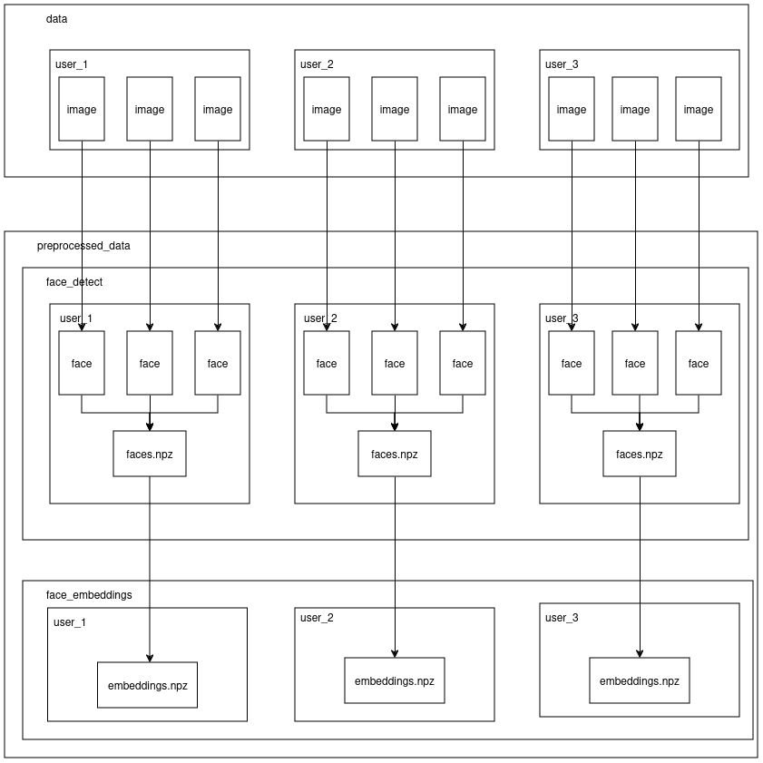

Create a `preprocessed_data` folderin the same location as `data` folder. The `preprocessed_data` folder should contain two subfolders: `face_detect` and `face_embeddings`.

1. `face_detect` folder:

- Contains extracted facial images from the original dataset

- Organized into subfolders named after each person
- Each subfolder includes:

    - Face images extracted from that person's original photos
    - A single `faces.npz` file containing numpy arrays of all facial data
    
Note: The individual images are for visualization only; the model works with the numpy arrays stored in the .npz file

2. `face_embeddings` folder:

Inside there are many subfolders with the name of the person, each subfolder contains a `embeddings.npz` file that stores the embeddings of that person's faces. We take inout as the faces.npz file from a person's folder, pass it through the FaceNet model to get the embeddings, and store them in the embeddings.npz file in corresponding subfolders named after the person.

The pipeline look something like this:

