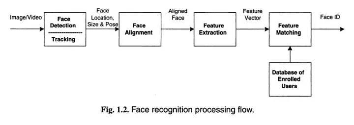
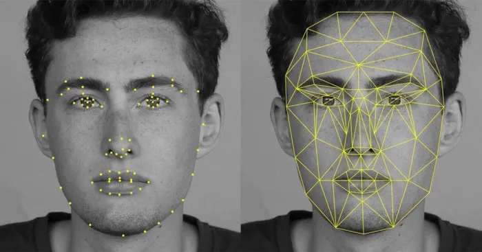

#  2D Face recognition

Lưu ý check lại thông tin, bìa viết đã không được cập nhật trong 8 năm: https://viblo.asia/p/opencv-nhan-dang-face-recognition-ZjlearmzkqJ

# Intro

Face recognition là một lĩnh vực nghiên cứu của ngành Computer Vision, và cũng được xem là một lĩnh vực nghiên cứu của ngành Biometrics (về bản chất gần như tương đồng với Fingerprint hay iris recognition chỉ khác về các feature được extract ra với mỗi loại) 

Finger print thi can extract ra nhưng cái gì, iris thi can extract ra nhưng cái gì, face recognition thi can extract ra nhưng cái gì ????

Face Recognition là bài toán nhận dạng và xác thực người dựa vào khuôn mặt của họ. Đối với con người thì đó là một nhiệm vụ rất đơn giản, thậm chí là ở trong những điều kiện môi trường khác nhau, tuổi tác thay đổi, đội mũ, đeo kính, … Tuy nhiên, đối với máy tính thì nó vẫn còn là một thử thách khó khăn trong vài thập kỷ qua cho đến tận ngày nay. Trong thời đại bùng nổ của trí tuệ nhân tạo, tận dụng sức mạnh của các thuật toán DL và lượng dữ liệu vô cùng lớn, chúng ta có thể tạo ra các models hiện đại, cho phép biểu diễn khuôn mặt thành các vectors đặc trưng trong không gian nhiều chiều. Để từ đó, máy tính có thể thực hiện nhận diện ra từng người riêng biệt, mà thậm chí còn vượt qua khả năng của con người trong một số trường hợp.

Vi du: https://www.forbes.com/sites/amitchowdhry/2014/03/18/facebooks-deepface-software-can-match-faces-with-97-25-accuracy/

Earlier this year Facebook created DeepFace, a facial recognition system almost as accurate as the human brain. In a standardized test involving pairs of photographs, a human being would get the answer correct 97.53% of the time; Facebook’s technology scored an impressive 97.25%. Most people thought that was as far as facial recognition breakthroughs would go in 2014. They were wrong.

Tìm thêm số liệu mới hơn ????

## Thực trạng, Tiền năng của face recognition:

Trong khi các phương pháp sinh trắc học khác như khi nhận dạng vân tay và mống mắt đã đạt tới độ chín, tức là có thể áp dụng trên thực tế một cách rộng rãi thì nhận dạng mặt người vẫn còn nhiều thách thức và vẫn là một lĩnh vực nghiên cứu thú vị với nhiều người.

Không chỉ có tiềm năng trong việc bảo mật mà ta bản tới trong dự án này mà face recognition còn có thể ứng dụng trong nhiều lĩnh vực khác như: giám sát trên quy mô đô thị, giám sát giao thông, giám sát an ninh dặc biệt khi kết hợp với phân tichs dữ liệu lớn và AI . Vd Skynet (Lưới trời) của Trung Quốc ... theo https://trithucvn2.net/trung-quoc/phia-sau-du-an-skynet-cua-trung-quoc-voi-hon-600-trieu-camera-giam-sat.html

Các thiết bị ứng dụng của face recognition: Mớ khóa khuôn mặt 2D trên các thiết bị động android, Windows Hello trên Windows 10, Face ID trên các sản phẩm của Apple, máy chấm công bằng nhận dạng khuôn mặt, camera an ninh, điểm danh,....

Nhận diện khuôn mặt (Face Recognition) là một trong những thách thức lớn mà các nhà nghiên cứu về Học máy - Học sâu đã và đang phải đối mặt. Bài toán này có thể được áp dụng ở rất nhiều lĩnh vực khác nhau, đặc biệt trong những lĩnh vực yêu cầu độ chính xác và bảo mật cao như eKYC trong E-Comercial và nhận diện danh tính qua surveillance camera (CCTV)

## Định hướng phát triển của dự án:

Hiện nay các phương pháp nhận dạng mặt được chia thành nhiều hướng theo các tiêu chí khác nhau: nhận dạng với dữ liệu đầu vào là ảnh tĩnh 2D(still image based FR) là phổ biến nhất, tuy nhiên tương lai có lẽ sẽ là 3D FR (vì việc bố trí nhiều camera 2D sẽ cho dữ liệu 3D và đem lại kết quả

- Áp dụng để tổng hợp ảnh 3D, xử lý trên video thời gian thực, liên kết với dữ liệu dân cư

Face recognition is a technique of identification or verification of an individual using their face in a video or photo. This computer vision task captures, analyzes, and compares patterns based on the person’s facial details.

The 2011 book on face recognition titled “Handbook of Face Recognition” describes two main modes for face recognition, as:

A face recognition system is expected to identify faces present in images and videos automatically. It can operate in either or both of two modes: (1) face verification (or authentication), and (2) face identification (or recognition).

Face Verification. A one-to-one mapping of a given face against a known identity (e.g. is this the person?).
    Face Identification. A one-to-many mapping for a given face against a database of known faces (e.g. who is this person?).

Use case of Face Recognition Technology

This technology is used by many companies and organizations, some that you’re probably aware of, and there are some that you’re possibly not. Here are some examples of Face Recognition Technology:

- Access Control: Access control of personal computers, homes, cars, offices, and other premises is one of the most apparent methods of using Face Recognition. And Apple’s iPhone X is a perfect example of using FRT to unlock a smartphone.
    
- Shopping Online: Alibaba, a prominent Chinese e-commerce company, plans to use the Alipay platform to let users make purchases over the Internet. And as a first step, Alipay has already launched a ‘Smile to Pay’ facial recognition system at a KFC in Hangzhou. The system recognizes a face within two seconds and then verifies the scan by sending a mobile alert. ‘Smile to Pay’ is also able to identify people wearing make-up or wigs as a disguise.
    
- Helping addictive gamblers: The face recognition system merely compares the faces of individuals who play slots with self-proclaimed problem gamblers in casinos. It alerts the security team when the device detects a match, which then discreetly approaches the gamblers and escorts them off the premises.
    
- Tracking down criminals: And this one won’t come as a surprise. Facial recognition is a crime-fighting technology that is used to recognize targets by law enforcement and intelligence agencies. For example, the officer only has to snap a picture and voila with the assistance of MORIS (Mobile Offender Identification and Information System)-a portable biometric device attached to a smartphone.
    
- Organizing photos: The most widespread way to use this technology is done by Apple, Google, and even Facebook to differentiate a portrait from a landscape, find a user in a frame, and sort photos by categories using their own face recognition systems. And we all provide tremendous support for the facial recognition algorithm every time we upload a picture and tag our friends on it.
    
- Taking attendance in school: Schools in the UK use FRT in order to attend. This has been going on for a while in the UK, but will definitely spread to other nations as well. Both students and teachers in the UK love this new technology that scans faces with infra-red light and matches them with archived images.

Tim them anh ve may cai nay ????

## Thách thức

Challenges in Recognition Systems

Facing challenges while working on recognition systems in common, all you need to learn is how to get out of them. Here are some common challenges:

- Pose: Recognition systems are susceptible to the human pose. Facial recognition systems will not be able to predict if the person’s face is not visible.
    
- Illumination: Illumination changes the face contours drastically. Face recognition pictures should be clear with proper brightness.
    
- Facial Expressions: Different facial expressions can result in different predictions of the same person’s Image.
   
- Low Resolution: Low-resolution pictures contain less information, hence not good for face recognition training.

- Projection/Camera Angle: The angle of the camera can affect the face recognition system. The face should be visible to the camera for proper recognition.

## Các hướng nghiên cứu đã có:

**Traditional Face Recognition Algorithm**

Traditional face recognition algorithms don’t meet modern-day’s facial recognition standards. They were designed to recognize faces using old conventional algorithms.

OpenCV provides some traditional facial Recognition Algorithms.

- Eigenfaces
- Scale Invariant Feature Transform (SIFT)
- Fisher faces
- Local Binary Patterns Histograms (LBPH)

These methods differ in the way they extract image information and match input and output images.

LBPH algorithm is a simple yet very efficient method still in use but it’s slow compared to modern days algorithms.

**Deep Learning For Face Recognition**

There are various deep learning-based facial recognition algorithms available.

- DeepFace
- DeepID series of systems,
- FaceNet
- VGGFace

May cai nay first introduce nam nao???

Generally, face recognizers that are based on landmarks take face images and try to find essential feature points such as eyebrows, corners of the mouth, eyes, nose, lips, etc. There are more than 60 points.

https://www.analyticsvidhya.com/blog/2022/04/face-recognition-system-using-python/

Gồm các hướng tiếp cận:

- phuong pháp toàn cục, vd như PCA, LDA, SVM, Neural Network, CNN, RNN, GAN, ...
- phương pháp cục bộ, vd như LBP, HOG, SIFT, SURF, ...
- phương pháp kết hợp, vd như phương pháp kết hợp giữa CNN và RNN, CNN và GAN, ...

Nhưng trong đó, phương pháp sử dụng Deep Learning, đặc biệt là Convolutional Neural Network (CNN) đang là xu hướng phổ biến và hiệu quả nhất hiện nay ????

Các phuowgn pháp cục bộ đã chứng tỏ sư ưu việt  hơn khi làm việc trong các điều kiện không có kiểm soát và có thể nói rằng lịch sử phát triển của nhận dạng mặt (A never ending story) là sự phát triển của các phương pháp trích chọn đặc trưng (feature extractrion methods) được sử dụng trong các hệ thống dựa trên feature based

Ko chắc đúng, check lại ???

Hai bài toán chính trong face recognition:

- Face verification: xác nhận xem hai ảnh có chứa cùng một người hay không (1:1)

- Face recognition: xác định xem ảnh đầu vào chứa người nào trong tập dữ liệu đã biết (1:N)

Còn 1 thuật ngữ nữa là Face detection: là bài toán xác định xem có khuôn mặt trong ảnh hay không, nếu có thì vị trí của nó là gì ???  -> đây chỉ là một bước tiền xử lý cho bài toán nhận dạng mặt

Face Recognition có thể chia thành 3 bài toán nhỏ:

    Face Authentication: Hạn chế quyền truy cập của một người đến một nguồn tài nguyên nào đó.
    Face Verification: Xác nhận một người phù hợp với ID của họ.
    Face Identification: Gán chính xác tên của người.

Ba bài toán này thực ra chỉ khác nhau ở mục đích sử dụng kết quả nhận diện khuôn mặt vào việc gì, còn về bản chất vẫn là phân loại xem khuôn mặt cần nhận diện có thuộc vào nhóm nào trong bộ dữ liệu cho trước hay không?

Tất cả những bài toán này đều cần phải được giải quyết trong cả 3 trường hợp:

- Người trong ảnh
- Người trong file video
- Người thực (stream real-time từ camera)

Tuy nhiên, cũng lại xuất hiện thêm một bài toán con con nữa, đó là đôi khi chúng ta cần phân biệt đâu là người thật, đâu là người giả (người trong video hay ảnh). Vì nếu chúng ta đối xử với cả 3 trường hợp đều như nhau thì rất có thể kẻ gian sẽ lợi dụng để truy cập trái phép vào hệ thống thông qua một bức ảnh, cái mà rất dễ dàng có được.

# IR cam

Camera hồng ngoại (IR) được sử dụng trong mở khóa khuôn mặt vì nó giúp cải thiện tính chính xác và độ an toàn của hệ thống. Dưới đây là một số lý do chính tại sao cần sử dụng camera IR thay vì camera thông thường:

    Hoạt động tốt trong điều kiện ánh sáng yếu hoặc ban đêm:
        Camera thông thường phụ thuộc vào ánh sáng nhìn thấy (visible light), vì vậy khi ánh sáng yếu hoặc tối hoàn toàn, nó sẽ khó có thể nhận diện khuôn mặt chính xác.
        Camera IR phát ra tia hồng ngoại, cho phép nhận diện khuôn mặt trong điều kiện ánh sáng yếu hoặc không có ánh sáng mà không cần đèn nền.

    Phát hiện giả mạo (liveness detection):
        Camera IR có thể phân biệt giữa hình ảnh hoặc video của khuôn mặt và khuôn mặt thật. Nó có thể phát hiện các dấu hiệu như nhiệt độ cơ thể hoặc các chi tiết bề mặt da mà các camera thông thường khó làm được.
        Điều này giúp tránh các trường hợp bị lừa bởi việc sử dụng ảnh chụp hoặc video để đánh lừa hệ thống.

    Giảm thiểu ảnh hưởng của điều kiện ánh sáng thay đổi:
        Camera thông thường dễ bị ảnh hưởng bởi ánh sáng chói hoặc bóng tối, dẫn đến sự không ổn định trong việc nhận diện khuôn mặt.
        Camera IR không bị ảnh hưởng bởi những thay đổi trong ánh sáng xung quanh, giúp duy trì độ chính xác ổn định.

    Tăng cường khả năng bảo mật:
        Sử dụng camera IR cho phép hệ thống phân tích thêm các đặc điểm bề mặt khuôn mặt và kết cấu 3D, làm cho việc giả mạo trở nên khó khăn hơn.
        Một số hệ thống còn sử dụng camera IR để đo độ sâu (depth sensing), giúp tạo ra mô hình 3D của khuôn mặt, làm tăng độ an toàn và chính xác.

Như vậy, camera IR mang lại nhiều lợi ích quan trọng cho hệ thống nhận diện khuôn mặt, đặc biệt là về tính chính xác và bảo mật trong mọi điều kiện ánh sáng.

## Pipeline

để xây dựng một hệ thống nhận dạng mặt, ta cần thực hiện các bước sau:

- Step 1: Data collection: thu thập dữ liệu ảnh khuôn mặt từ nhiều nguồn khác nhau
-
- Step 2: Data preprocessing: tiền xử lý dữ liệu ảnh khuôn mặt. bao gồm các bước căn chỉnh ảnh (face image alignment) và chuẩn hóa ánh sáng (illumination normalization) (ở đây tôi đang nói tới các ảnh có góc nhìn thẳng – frontal view face image)

A Face Recognition pipeline can be divided into three major stages:

- Face Detection
- Face Alignment
- Feature Extraction
- Feature Matching

In this article, I will not explain the working architecture of each algorithm I list down for each major stage but will give you an idea of their use cases and you could dive deep into those algorithms which you think are applicable for your face recognition project.

Step 2 
**Face Detection**

Face Detection là bước đầu tiên trong bài toán Face Recognition, có vai trò rất lớn trong việc nâng cao độ chính xác của toàn bộ hệ thống. Đầu vào của nó là một bức ảnh có chứa mặt người, đầu ra của nó sẽ là các tọa độ của vùng chứa khuôn mặt, thường thể hiện bằng một hình chữ nhật bao quanh khuôn mặt đó.

Có 2 phương pháp tiếp cận để giải quyết vấn đề ở bước này:

    Feature-based: Sử dụng các bộ lọc thủ công (hand-crafted filters) để tìm kiếm và định vị vị trí khuôn mặt trong ảnh. Phương pháp này rất nhanh và hiệu quả trong điều kiện gần lý tưởng, nhưng không hiệu quả trong điều kiện phức tạp hơn.

        Điều kiện gần lý tưởng: Ảnh chất lượng cao, khuôn mặt nằm ở trung tâm, không bị che khuất, không bị nghiêng, không bị mờ, không bị nhiễu, không bị thay đổi ánh sáng, … chỉ có ít khuon mặt trong ảnh.

        Điều kiện phức tạp: Ảnh chất lượng thấp, khuôn mặt nằm ở ngoài lề, bị che khuất, bị nghiêng, bị mờ, bị nhiễu, bị thay đổi ánh sáng, … có nhiều khuôn mặt trong ảnh.
    

    Image-based: Sử dụng các thuật toán DL để học và tự động định vị vị trí khuôn mặt dựa trên toàn bộ bức ảnh. Ưu điểm của phương pháp này là độ chính xác cao hơn so với phương pháp Feature-based, nhưng tốc độ thực hiện thì lại chậm hơn. Tùy theo điều kiện cụ thể của từng bài toán mà ta chọn phương pháp phù hợp. VD: chạy trên thiết bị nào (PC hay Embedded Device), có cần Real-time hay không, điều kiện môi trường xung quanh ra sao, …

Dưới đây là bảng tổng hợp các thư viện và thuật toán cho mỗi phương pháp này:

Chạy thử trên máy xem thời gian khác bọt như nàO ??? ghi rõ cấu hình, thời gian, ... ???

Nhìn chung, phương pháp Image-based có sử dụng các thuật toán DL nên độ chính xác cao hơn so với phương pháp Feature-based. Nhưng đổi lại, xét về tốc độ thực hiện thì Feature-based lại là kẻ chiến thắng. Tuy nhiên, điều này chỉ biểu hiện rõ rệt nếu chúng ta chạy trên các thiết bị có cấu hình thấp, kiểu như các thiết bị nhúng, còn nếu chạy trên PC hay server thì sự khác biệt về tốc độ thực thi giữa 2 phương pháp là không đáng kể.

A Face detection method is used to find the faces present in the given image, extract faces if exist, and crop the face only to create a compressed file for further feature extraction. There are multiple algorithm options to perform this task in a face detection/recognition system.
Methods used in Face Detection:

- Haar cascade Face Detection: Haar Cascade based Face Detector was the state-of-the-art in Face Detection for many years since 2001 when it was introduced by Viola and Jones in their paper, “Rapid Object Detection using a Boosted Cascade of Simple Features”. There have been many improvements in recent years. This method has a simple architecture that works nearly real-time on the CPU. Also, it can detect images at different scales. But the major drawback is that it gives false results as well as it doesn’t work on non-frontal images.
    
- Dlib (HOG) Face Detection: This is a widely used face detection model, based on HoG features and SVM published in 2005 in the paper “Histograms of oriented gradients for human detection”. HOG, or Histogram of Oriented Gradients, is a feature descriptor that is often used to extract features from image data. It is the fastest method on CPU which can work on frontal and slightly no-frontal images. But it is incapable of detecting small images and handling occlusions. Also, it often excludes some parts of the chin and forehead while detection.
    
- Dlib (CNN) Face Detection: This method first introduced in the 2016 paper “CNN based efficient face recognition technique using Dlib” uses a Maximum-Margin Object Detector ( MMOD ) with CNN based features. The training process for this method is very simple and you don’t need a large amount of data to train a custom object detector. It works very fast on GPU and is capable to work for various face orientations in images. It can also handle occlusions. But the major disadvantage is that it is trained on a minimum face size of 80*80 so it can’t detect small faces in images. It is also very slow on the CPU.
    
- MTCNN Face Detection: Multi-task Cascaded Convolutional Networks (MTCNN) is a framework developed as a solution for both face detection and face alignment. This method was first introduced in a paper named “Joint Face Detection and Alignment using Multi-task Cascaded Convolutional Networks” in 2016. This method gives the most accurate results out of all the four methods. It works for faces having various orientations in images and can detect faces across various scales. It can even handle occlusions. It doesn’t hold any major drawback as such but is comparatively slower than HOG and Haar cascade method.

You can refer to this site: https://learnopencv.com/face-detection-opencv-dlib-and-deep-learning-c-python/ to get a detailed understanding of the above differences.

**Face Alignment**

Face alignment is an early phase of the modern pipeline of face recognition. Google has reported that face alignment improves the accuracy of its FaceNet face recognition model from 98.87% to 99.63%. This is an increase in accuracy of almost 1 percent. We can easily apply 2D face alignment inside OpenCV in Python. With haar cascade configurations in OpenCV has modules for both frontal face and eye detection. Extracting the eye locations is very important to align faces. OpenCV finds eye locations with conventional haar cascade method. After getting the eye location of the detected face you can rotate the image 1 degree until both eyes are horizontal. This will increase the complexity of the solution so you can align the face based on angles between two eyes using the cosine rule. MTCNN also finds some facial landmarks such as eye, nose, and mouth locations. If we are using MTCNN in the face recognition pipeline it will automatically do an alignment to the face detected.

REf: https://medium.com/backprop-labs/face-recognition-pipeline-clearly-explained-f57fc0082750

**Step 4**

Feature Extraction

Feature extraction is the basic and most important initializing step for face recognition. It extracts the biological components of your face. These biological components are the features of your face that differ from person to person. There are various methods which extract various combination of features, commonly known as nodal points. No two people can have all the nodal points similar to each other except for identical twins.

Methods used in Feature Extraction (Deep Approach):

There was a flurry of research and publications in 2014 and 2015 on deep learning methods for face recognition. Capabilities reached near-human-level performance rapidly, then surpassed human-level performance over a three-year span on a standard face recognition dataset. So these advances have been powered by four milestone systems for deep learning for face recognition: DeepFace, the DeepID series of systems, VGGFace, and FaceNet.

VGGFace: The VGG-Face CNN descriptors are computed using our CNN implementation based on the VGG-Very-Deep-16 CNN architecture and are evaluated on the Labeled Faces in the Wild and the YouTube Faces dataset. VGG uses various architectures such as VGGFace1, VGGFace2 by Keras. The basic difference among these models is the number of layers included in its architecture that varies from model to model. These models have quite good accuracy.

FaceNet: FaceNet is a face recognition system developed in 2015 by researchers at Google in their 2015 paper titled “FaceNet: A Unified Embedding for Face Recognition and Clustering”, that achieved then state-of-the-art results on a range of face recognition benchmark datasets and presented an innovation called ‘triplet loss‘ that allowed images to be encoded efficiently as feature vectors that allowed rapid similarity calculation and matching via distance calculations. The FaceNet system can be used broadly thanks to multiple third-party open-source implementations of the model and the availability of pre-trained models. The FaceNet system can be used to extract high-quality features from faces, called face embeddings, which can then be used to train a face identification system.

DeepFace: DeepFace is a system based on deep convolutional neural networks. It was described in the 2014 paper titled “DeepFace: Closing the Gap to Human-Level Performance in Face Verification.” It was perhaps the first major leap forward using deep learning for face recognition, achieving near human-level performance on a standard benchmark dataset.

DeepID (Deep hidden IDentity features): The DeepID is a series of systems (e.g. DeepID, DeepID2, etc.), first described by Yi Sun, et al. in their 2014 paper titled “Deep Learning Face Representation from Predicting 10,000 Classes.” Their system was first described much like DeepFace, although was expanded in subsequent publications to support both identification and verification tasks by training via contrastive loss. The DeepID systems were among the first deep learning models to achieve better-than-human performance on the task.

### Face Embedding 

Face Embedding

Đây là bước thứ 2 trong bài toán Face Recognition. Input của nó là bức ảnh khuôn mặt đã tìm ra ở bước 1, còn Output là một Vector nhiều chiều thể hiện đặc trưng của khuôn mặt đó.

Hai thuật toán phổ biến nhất hiện nay để thực hiện Face Embedding là FaceNet và VGGNet.

    FaceNet được tạo ra bởi Florian Schroff và đồng nghiệp tại Google. Họ đã miêu tả nó trong bài báo năm 2015 với tiêu đề FaceNet: A Unified Embedding for Face Recognition and Clustering. Ý tưởng của FaceNet được gọi là Triplet Loss, cho phép hình ảnh được mã hóa hiệu quả dưới dạng vectơ đặc trưng, để từ đó tính toán và đối sánh độ tương đồng nhanh chóng thông qua các phép tính khoảng cách trong không gian. Hệ thống của họ đã đạt được kết quả state-of-the-art.

FaceNet, that directly learns a mapping from face images to a compact Euclidean space where distances directly correspond to a measure of face similarity. […] Our method uses a deep convolutional network trained to directly optimize the embedding itself, rather than an intermediate bottleneck layer as in previous deep learning approaches. To train, we use triplets of roughly aligned matching / non-matching face patches generated using a novel online triplet mining method. — FaceNet: A Unified Embedding for Face Recognition and Clustering, 2015.

    VGGFace được phát triển bởi Omkar Parkhi và đồng nghiệp từ Visual Geometry Group (VGG) tại Oxford. Nó được mô tả trong bài báo năm 2015 của họ có tiêu đề Deep Face Recognition. Trọng tâm chính của họ là thu thập một tập dữ liệu đào tạo rất lớn và sử dụng tập dữ liệu này để đào tạo một mô hình CNN rất sâu về khả năng nhận diện khuôn mặt.

… we show how a very large scale dataset (2.6M images, over 2.6K people) can be assembled by a combination of automation and human in the loop — Deep Face Recognition, 2015.

Cả 2 thuật toán này đều có Pre-trained model. Chúng ta hoàn toàn có thể sử dụng chúng một cách miễn phí trong các dự án của mình. Mình sẽ đi chi tiết hơn về cách dùng mỗi thuật toán này trong các bài tiếp theo.

Về Facenet xem rõ hơn trong Blog này: https://tiensu.github.io/blog/54_face_recognition_facenet/

Về VGGFace xem rõ hơn trong Blog này: https://tiensu.github.io/blog/53_face_recognition_vggface/

**Step 5**: bước nhận dạng (recognition) hay phân lớp (classification), tức là xác định danh tính (identity) hay nhãn (label) của ảnh – đó là ảnh của ai. Các phương pháp vd như: KNN, SVM, Neural Network, CNN, RNN, GAN, ...  thêm vài cái trong khóa Biometric vào đây ?????

Feature Classification

The final stage of face detection technology is to make a decision whether the face’s features of a new sample are matching with the one from a facial database or not. These template-based classifications are possible using various statistical approaches. It usually takes just seconds.

- Euclidean Distance: It is a distance-based feature classification method that calculates the distance between the facial nodes and the face which has the minimum difference between these distance values is considered to be the match. But it is suitable for the datasets having a smaller number of classes and lower-dimensional features.
- Cosine Similarity: In cosine similarity, the solution that we obtain after calculating the cosine of an angle is brought into concern. Here, we would compare the differences between these results. The more the value is closer to 1, the greater is the probability of the match. But it may give a false result if the test data features are incomplete.
- SVM (Support vector machine): SVM creates an optimal hyperplane to classify the classes of the training dataset based on the different features of the face. The dimensionality of the hyperplane is one less than the number of features. Different kernels can be applied to see what features are used by the classifier to remove the features if required. This can help to improve speed.
- KNN (K-Nearest Neighbor): KNN is all about the number of neighbors i.e. the k value. In KNN, if k=3 then we check that the data is close to which 3 data points. Thereafter, it is decided that the majority of the closest data points belong to which class. Now, the test data is predicted to be in this class KNN has a curse of dimensionality problem which can be solved by applying PCA before using the KNN classifier. You can get a better understanding of KNN
- ANN (Artificial Neural Network): ANN uses a very detailed algorithm for face recognition. It classifies the local texture using a multi-layer perceptron for face alignment. It uses a geometric feature-based and independent component analysis for feature extraction and multi artificial neural network for feature matching.

Face Classification

Nhiệm vụ của bước này là phân loại khuôn mặt vào các nhóm xác định trước trong tập dữ liệu, dựa vào Vector đặc trưng của chúng. Chúng ta có 3 phương pháp:

    Dựa vào khoảng cách: Tính toán và so sánh khoảng cách giữa các Vectors. Khoảng cách càng nhỏ chứng tỏ các Vectors càng giống nhau. Thuật toán kNN là đại diện tiêu biểu cho việc sử dụng khoảng cách để phân loại, ta có thể áp dụng nó. Khoảng cách ở đây có thể sử dụng công thức Cosine hoặc Euclidean. Ưu điểm của phương pháp này là đơn giản, thực thi nhanh nếu số lượng khuôn mặt không nhiều. Nhược điểm là độ chính xác không cao, tốc độ thực thi giảm nếu số lượng khuôn mặt tăng lên.
    Sử dụng ML: Ta có thể dùng các Vectors đặc trưng của khuôn mặt để huấn luyện một ML model, với các thuật toán như SVM, Decision Tree, … Thuật toán SVM thường được sử dụng nhiều hơn. Phương pháp này cân bằng giữa tốc độ thực hiện và độ chính xác.
    Sử dụng DL: Tương tự vậy, ta cũng có thể huấn luyện một DL model đơn giản (3-5 FC layers) từ các Vectors đặc trưng của khuôn mặt. Phương pháp này thường có độ chính xác cao nhất (nếu DL model đủ tốt), nhưng tốc độ thực hiện lại chậm nhất.

Ngoài ra, trong các bài toán thực tế, để tăng độ chính xác lên cao nhất có thể, chúng ta có thể kết hợp phương pháp 1 và 3, hoặc phương pháp 1 và 2.

# Code

## Data collection

## Data preprocessing

## Device dataset

ta chia dataset ra lam 3 phan: training, validation, testing . validation dung de tuning hyperparameter, su do, ta gop training va validation lai de train model cuoi cung, testing set dung de kiem tra model cuoi cung.

## Pre processing

Vấn đề: 

Hầu hết các thuật toán nhận dạng khuôn mặt cực kỳ nhạy cảm với điều kiện ánh sáng, do đó nếu nó được huấn luyện để nhận ra một người khi họ đang ở trong một căn phòng tối, thì có lẽ nó wont nhận ra họ trong một căn phòng sáng, vv Vấn đề này được gọi là "lumination phụ thuộc ",

cũng có nhiều vấn đề khác, chẳng hạn như mặt cũng phải ở trong một vị trí rất phù hợp trong những hình ảnh (như mắt là trong cùng một điểm ảnh tọa độ), kích thước phù hợp, góc quay, tóc và trang điểm, cảm xúc ( mỉm cười, giận dữ, vv), vị trí của đèn (bên trái hoặc bên trên, vv). 

- .....

Đây là lý do tại sao nó là rất quan trọng để sử dụng một bộ lọc hình ảnh tốt tiền xử lý trước khi áp dụng nhận dạng khuôn mặt. Bạn cũng nên làm những việc như loại bỏ các điểm ảnh xung quanh khuôn mặt mà không được sử dụng, chẳng hạn như với một mặt nạ hình elip để chỉ hiển thị các khu vực mặt bên trong, không phải là tóc và hình nền, kể từ khi họ thay đổi nhiều so với khuôn mặt không. 

Để đơn giản , hệ thống nhận diện khuôn mặt tôi sẽ cho bạn thấy là Eigenfaces sử dụng hình ảnh thang độ xám. Vì vậy, tôi sẽ cho bạn thấy làm thế nào để dễ dàng chuyển đổi hình ảnh màu xám (còn được gọi là "màu xám"), và sau đó dễ dàng áp dụng Histogram Equalization là một phương pháp rất đơn giản của tự động tiêu chuẩn hóa độ sáng và độ tương phản của hình ảnh gương mặt của bạn. Để có kết quả tốt hơn, bạn có thể sử dụng màu sắc nhận diện khuôn mặt (lý tưởng với phụ kiện màu sắc biểu đồ trong HSV hoặc một không gian màu thay vì RGB), hoặc áp dụng nhiều công đoạn chế biến như tăng cường cạnh, phát hiện đường viền, phát hiện chuyển động, vv Ngoài ra, mã này là thay đổi kích thước hình ảnh đến một kích thước tiêu chuẩn, nhưng điều này có thể thay đổi tỷ lệ khía cạnh của khuôn mặt.

## Face detection va Face recognitiojn

Phan 1
https://viblo.asia/p/nhan-dien-khuon-mat-voi-mang-mtcnn-va-facenet-phan-1-Qbq5QDN4lD8

Phan 2
https://viblo.asia/p/nhan-dien-khuon-mat-voi-mang-mtcnn-va-facenet-phan-2-bJzKmrVXZ9N

https://www.pandaml.com/nhan-dang-khuon-mat/

https://medium.com/@shendyeff/documentation-project-face-recognition-system-with-opencv-2d18793623d6

https://www.datacamp.com/tutorial/face-detection-python-opencv

## Processing

https://www.analyticsvidhya.com/blog/2022/04/face-recognition-system-using-python/

Step 1: Face detection

In openCV, the face detection is done by using Haar Cascades (còn gọi là phương pháp Viola-Jones). Haar Cascade is a machine learning object detection algorithm used to identify objects in an image or video and based on the concept of features proposed by Paul Viola and Michael Jones in their paper "Rapid Object Detection using a Boosted Cascade of Simple Features" in 2001. 

### Approach Model

One shot learning with Siamese Networks
https://vinbigdata.com/kham-pha/tong-quan-ve-one-shot-learning-trong-thi-giac-may-tinh.html

https://www.cs.cmu.edu/~rsalakhu/papers/oneshot1.pdf

Reference: 

https://tiensu.github.io/blog/52_face_recognition/

https://www.analyticsvidhya.com/blog/2022/04/face-recognition-system-using-python/

Du an Github tham khao:

https://github.com/huytranvan2010/Face-Recognition-with-OpenCV-Python-DL